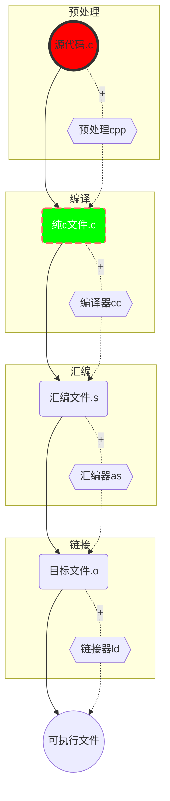

# 2048简单说明

以2048.c源文件的编译为例，如下
gcc -o 2048 2048.c
这里gcc编译器将2048.c翻译成了机器能执行的文件2048
其实，这个翻译过程可以细分为4步，

```mermaid
graph TD
	subgraph 预处理
		A((源代码.c))-.-|+|A1{{预处理cpp}}
		%% 红色填充，		黑色stroke，线框4像素，
		style A fill:#f00,stroke:#333,stroke-width:4px
	end
	subgraph 编译
		B(纯c文件.c)-.-|+|B1{{编译器cc}}
		%% stroke-dasharray属性设置虚线边框的点的大小(长10宽5)
    style B fill:#0f0,stroke:#f66,stroke-width:2px,color:#fff,stroke-dasharray: 10 5
	end
	subgraph 汇编
		C(汇编文件.s)-.-|+|C1{{汇编器as}}
	end
	subgraph 链接
		D(目标文件.o)-.-|+|D1{{链接器ld}}
	end
	E((可执行文件))
	
	A--> B;
	A1-.->B
	
	B-->C
	B1-.->C

	C-->D
	C1-.->D
	
	D-->E
	D1-.->E
```

